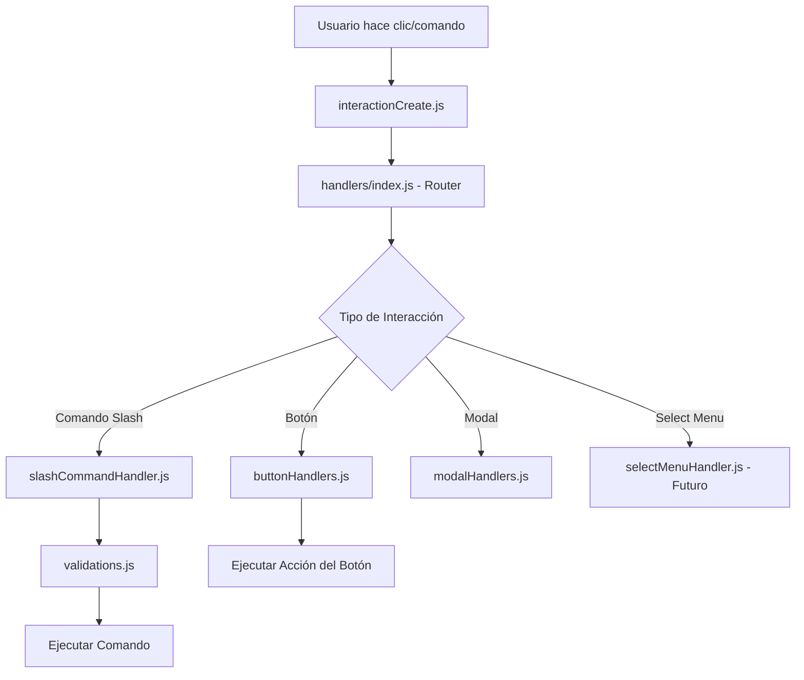

# 🏗️ Arquitectura Modular del Sistema de Interacciones

## 🎯 **¿Qué se Modularizó?**

**ANTES:** Todo el código estaba en `interactionCreate.js` (298 líneas)
**AHORA:** Sistema modular distribuido en múltiples archivos especializados

## 📁 **Nueva Estructura:**

```
extras/handlers/
├── index.js                 ← 🎯 Router principal
├── validations.js           ← 🔐 Sistema de validaciones
├── slashCommandHandler.js   ← ⚡ Manejo de comandos slash
├── buttonHandlers.js        ← 🔘 Manejo de botones
└── modalHandlers.js         ← 🖼️ Manejo de modales (NUEVO)
```

## 🔧 **Componentes del Sistema:**

### 1. **🎯 Router Principal** (`handlers/index.js`)
- **Función**: Recibe cualquier interacción y la enruta al handler apropiado
- **Soporta**: Comandos slash, botones, select menus, modales
- **Ventaja**: Un solo punto de entrada, fácil expansión

```javascript
// Automáticamente detecta el tipo y enruta:
if (interaction.isChatInputCommand()) → slashCommandHandler
if (interaction.isButton()) → buttonHandlers
if (interaction.isStringSelectMenu()) → selectMenuHandler (futuro)
```

### 2. **🔐 Sistema de Validaciones** (`handlers/validations.js`)
- **Función**: Valida permisos, configuración del servidor, restricciones
- **Validaciones**:
  - ✅ Comando setup (siempre válido)
  - ✅ Servidor configurado
  - ✅ Restricciones de roles e IDs
- **Logs**: Detallados con prefijos `[VALIDATION]` y `[RESTRICTION]`

### 3. **⚡ Manejo de Comandos Slash** (`handlers/slashCommandHandler.js`)
- **Función**: Procesa todos los comandos slash (`/ping`, `/setup`, etc.)
- **Flujo**:
  1. Defer inmediato
  2. Obtener comando
  3. Validar permisos
  4. Ejecutar comando
- **Logs**: Prefijo `[SLASH-HANDLER]`

### 4. **🔘 Manejo de Botones** (`handlers/buttonHandlers.js`)
- **Función**: Maneja todas las interacciones de botones
- **Botones Actuales**:
  - `verify_button` - Verificación de usuarios
  - `create_ticket_button` - Crear ticket de soporte
  - `close_ticket_button` - Cerrar ticket
  - `create_donation_ticket_button` - Crear ticket de donación
  - `view_donation_packages_button` - Ver paquetes de donación
  - `approve_donation_button` - Aprobar donaciones (staff)
  - `reject_donation_button` - Rechazar donaciones (staff)
- **Logs**: Prefijo `[BUTTON]` y `[BUTTON-MANAGER]`

### 5. **🖼️ Manejo de Modales** (`handlers/modalHandlers.js`) - NUEVO
- **Función**: Procesa formularios modales (pop-ups interactivos)
- **Modales Actuales**:
  - `donation_form_modal` - Formulario completo de donación
  - `reject_donation_modal` - Formulario para rechazar donaciones
- **Características**:
  - ✅ Validación automática de datos
  - ✅ Creación de tickets privados
  - ✅ Prevención de duplicados
  - ✅ Permisos seguros automáticos
- **Logs**: Prefijo `[MODAL]` y `[MODAL-MANAGER]`

## 📝 **Flujo de una Interacción:**



## ➕ **Cómo Agregar Nuevos Handlers:**

### **🔘 Agregar Nuevo Botón:**

1. **En `buttonHandlers.js`:**
```javascript
const buttonHandlers = {
  // ... botones existentes ...
  
  nuevo_button: async (interaction) => {
    try {
      console.log(`🔘 [BUTTON] Procesando nuevo botón para ${interaction.user.username}`);
      
      // Tu lógica aquí
      await interaction.reply({ 
        content: '✅ ¡Nuevo botón funcionando!', 
        ephemeral: true 
      });
      
    } catch (error) {
      console.error('❌ [BUTTON] Error en nuevo botón:', error);
      await interaction.reply({ 
        content: '❌ Error al procesar botón.', 
        ephemeral: true 
      });
    }
  }
};
```

2. **En tu mensaje estático (`defaults.json`):**
```json
{
  "type": "button",
  "style": "Primary",
  "label": "Nuevo Botón",
  "emoji": "🆕",
  "customId": "nuevo_button"
}
```

### **📋 Agregar Select Menu Handler:**

1. **Crear `handlers/selectMenuHandlers.js`:**
```javascript
const selectMenuHandlers = {
  menu_ejemplo: async (interaction) => {
    const selectedValue = interaction.values[0];
    // Tu lógica aquí
  }
};

async function handleSelectMenuInteraction(interaction) {
  const handler = selectMenuHandlers[interaction.customId];
  if (handler) {
    await handler(interaction);
  }
}

module.exports = { handleSelectMenuInteraction };
```

2. **En `handlers/index.js`:**
```javascript
const { handleSelectMenuInteraction } = require('./selectMenuHandlers');

// En la función handleInteraction:
else if (interaction.isStringSelectMenu()) {
  await handleSelectMenuInteraction(interaction);
}
```

### **🖼️ Agregar Modal Handler:**

1. **En `modalHandlers.js`:**
```javascript
const modalHandlers = {
  ejemplo_modal: async (interaction) => {
    try {
      console.log(`🖼️ [MODAL] Procesando modal para ${interaction.user.username}`);
      
      // Obtener datos del formulario
      const inputValue = interaction.fields.getTextInputValue('input_id');
      
      // Tu lógica aquí
      await interaction.reply({ 
        content: `✅ Formulario procesado: ${inputValue}`, 
        ephemeral: true 
      });
      
    } catch (error) {
      console.error('❌ [MODAL] Error en modal:', error);
      await interaction.reply({ 
        content: '❌ Error al procesar formulario.', 
        ephemeral: true 
      });
    }
  }
};
```

2. **Para mostrar el modal (desde un botón):**
```javascript
// En buttonHandlers.js:
const modal = new ModalBuilder()
  .setCustomId('ejemplo_modal')
  .setTitle('Mi Formulario');

const input = new TextInputBuilder()
  .setCustomId('input_id')
  .setLabel('Escribe algo')
  .setStyle(TextInputStyle.Short);

modal.addComponents(new ActionRowBuilder().addComponents(input));
await interaction.showModal(modal);
```

## 🎯 **Ventajas de la Arquitectura Modular:**

### ✅ **Mantenibilidad:**
- Cada función en su archivo correspondiente
- Fácil encontrar y modificar código específico
- Menos conflictos al trabajar en equipo

### ✅ **Escalabilidad:**
- Agregar nuevos botones: solo editar `buttonHandlers.js`
- Nuevos tipos de interacciones: crear nuevo handler
- Sistema de validaciones centralizado y reutilizable

### ✅ **Debugging:**
- Logs específicos por módulo
- Errores más fáciles de rastrear
- Prefijos claros: `[VALIDATION]`, `[BUTTON]`, `[SLASH-HANDLER]`

### ✅ **Reutilización:**
- Validaciones reutilizables en cualquier handler
- Funciones de utilidad centralizadas
- Componentes independientes y testeable

### ✅ **Legibilidad:**
- `interactionCreate.js` de 298 líneas → 35 líneas
- Código auto-documentado con comentarios claros
- Separación clara de responsabilidades

## 📊 **Comparación Antes vs Ahora:**

| Aspecto | Antes | Ahora |
|---------|-------|-------|
| **Archivo principal** | 298 líneas | 35 líneas |
| **Agregar botón** | Editar archivo gigante | Agregar función en `buttonHandlers.js` |
| **Agregar validación** | Mezclar con otras funciones | Editar `validations.js` |
| **Debugging** | Buscar en 298 líneas | Ir directo al handler específico |
| **Mantenimiento** | Difícil | Fácil |
| **Escalabilidad** | Limitada | Infinita |

## 🚀 **Para Desarrolladores:**

### **Estructura de Logs:**
```
🔄 [INTERACTION-ROUTER] - Router principal
🎯 [SLASH-HANDLER] - Comandos slash
🔘 [BUTTON] - Botones individuales
🔘 [BUTTON-MANAGER] - Gestor de botones
🖼️ [MODAL] - Modales individuales
🖼️ [MODAL-MANAGER] - Gestor de modales
💰 [DONATIONS] - Sistema de donaciones
🔍 [VALIDATION] - Validaciones generales
🔒 [RESTRICTION] - Restricciones específicas
```

### **Orden de Ejecución:**
1. `interactionCreate.js` recibe la interacción
2. `handlers/index.js` enruta según el tipo
3. Handler específico procesa la lógica
4. `validations.js` valida si es necesario
5. Se ejecuta la acción final

### **Mejores Prácticas:**
- ✅ Siempre usar try/catch en handlers
- ✅ Logs descriptivos con prefijos
- ✅ Respuestas ephemeral para errores
- ✅ Validaciones antes de ejecutar lógica
- ✅ Nombres descriptivos para customId

## 🎉 **¡Sistema Completamente Modularizado!**

Ahora puedes:
- Agregar botones fácilmente
- Crear nuevos tipos de interacciones
- Mantener código limpio y organizado
- Debuggear eficientemente
- Escalar sin límites 